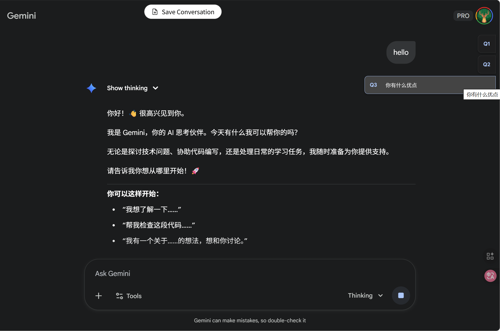

# AI-Chat-Navigator

> Gemini & ChatGPT 双端的轻量侧边导航油猴脚本，自动记录最近提问，一键跳转并高亮定位。

## 功能亮点
- 双平台自动识别：同一脚本兼容 `gemini.google.com` 与 `chatgpt.com`，站点不匹配时自动失效。
- 智能提问捕捉：监听用户提问区，仅保留最近 10 条，过长内容自动截断，对文件/图片消息给出占位提示。
- 一键定位与高亮：点击侧栏条目即刻滚动到对应提问，并短暂高亮，便于再次查看或继续追问。
- 轻量不打扰：仅注入必要 DOM 与样式，不劫持原站点快捷键；指针事件隔离以避免误操作。
- 性能优化：结合 `MutationObserver` + 指纹比对，避免重复渲染；提前截断文本，降低 DOM 与内存压力。

## 预览


## 使用方式
1. 浏览器安装 Tampermonkey 或同类脚本管理器。
2. 安装脚本：
   - 方式 A：GreasyFork 直接安装：https://greasyfork.org/zh-CN/scripts/556383-ai-%E8%81%8A%E5%A4%A9%E4%BE%A7%E8%BE%B9%E5%AF%BC%E8%88%AA-gemini-chatgpt
   - 方式 B：打开仓库中的 `ai-chat-navigator.user.js`，复制全部内容，在 Tampermonkey 中「添加新脚本」并保存。
3. 打开 ChatGPT 或 Gemini 页面，等待 1~2 秒，右侧会出现 60px 宽的悬停导航；鼠标悬停展开，点击即可跳转。

## 自定义配置
在脚本开头修改 `CONFIG` 即可：
```js
const CONFIG = {
    sidebarWidth: '60px',   // 折叠宽度
    hoverWidth: '300px',    // 悬停展开宽度
    maxItems: 10,           // 保留的提问条数
    labelLen: 30,           // 展示截断长度
    tooltipLen: 100,        // 提示截断长度
    zIndex: 9999,
    debug: false
};
```
保存后刷新页面生效。

## 文件结构
- `ai-chat-navigator.user.js`：主脚本。
- `image/image.png`：预览截图，可在 GitHub / GreasyFork 说明中引用。

## 常见问题
- 导航未出现？确认域名为 `chatgpt.com` 或 `gemini.google.com`，并确保脚本已启用后刷新页面。
- 记录条数不够？修改 `CONFIG.maxItems` 后刷新页面。
- 隐私与权限？脚本未声明任何额外权限，也不会发起网络请求，仅在当前页面内工作。

## 更新日志
- v2.0：合并 Gemini & ChatGPT 双端支持；滚动定位 + 高亮；虚拟列表可视性过滤；指纹比对减少重复渲染。

